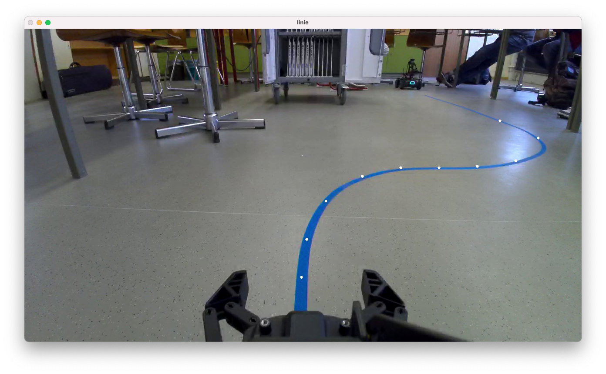

# Algorithmus für Linienverfolgung


## Übersicht
Das Programm besteht aus mehreren Teilen. **Es benötigt die `cv2` und `numpy`/`scipy`-Pakete.**

### [`stack.py`](stack.py)

Die Klasse `ActionStack` umschließt eine `Deque`, die nach dem "Last In First Out"-Prinzip, wie ein Stapel (Stack) funktioniert. Befehle (als Klassenobjekte des Typs `BaseAction`) können auf diesen Stapel gelegt werden. Soll eine oder mehrere Aktionen rückgängig gemacht werden, können die Befehle vom Stapel nacheinander herabgenommen werden. Diese Befehle können nun umgekehrt an den Roboter gesendet werden, um diese rückgängig zu machen.
Es ist auch möglich ein `Checkpoint`-Objekt auf diesen Stack zu legen. Dieses kann zum Beispiel an einer Kreuzung gesetzt werden, um später dorthin zurückzukehren, sollte der falsche Weg gewählt worden sein. Der Roboter kehrt automatisch zum letzten Checkpoint zurück, wenn die Methode `undo_until_checkpoint` der Klasse `ActionStack` aufgerufen wird. 

```python
# Solange rückgängig machen, bis ein Checkpoint-Objekt auf dem Stack liegt
def undo_until_checkpoint(self):
    while self.count() > 0:
        # Prüfe, ob das oberste Objekt aus dem Stack ein Checkpoint ist
        if self.peek().is_checkpoint():
            break
        # Objekt/Befehlsinstanz vom Stack herabnehmen und rückgängig machen
        self.pop().undo()
```
### [`actions.py`](actions.py)

Um den Code zu vereinfachen, wurden Befehle, die den Roboter bewegen, in eigene Klassen versetzt, die von einer gemeinsamen Klasse erben. Die Klassenstruktur ist folgendermaßen aufgebaut:
```
            ------ BaseAction ------
          /             |            \
     Checkpoint    AsyncAction    SyncAction
                        |             |
                 DriveSpeedAction  MoveDistanceSyncAction 
```

Eine Aktion, die von `SyncAction` erbt, führt einen synchronen Befehl aus, der automatisch stoppt, wie zum Beispiel `MoveDistanceSyncAction` (Fahren einer bestimmten Streckenlänge). Das heißt, der Funktionsaufruf blockiert den Code so lange, bis der Befehl fertig ist. Die erbende Klasse muss die Funktionen `def exec()` (Befehl ausführen) und `def undo()` (Befehl rückgängig machen) implementieren.

`AsyncAction` hingegen wird bei asynchronen Befehlen verwendet, die eine unbestimmte Zeit andauern können. Ein derartiger Befehl wird mit der Funktion `def begin()` gestartet und mit `def end()` gestoppt. 
`DriveSpeedAction` hat keine bestimmte Dauer und läuft asynchron zum restlichen Programm im Hintergrund. In diesem Fall wird die verstrichene Zeit zwischen Aufruf der `begin`/`end`-Funktion gespeichert, so dass es möglich ist, mit einem Aufruf von `def undo()`, die Aktion wieder rückgängig zu machen.

Diese wiederverwendbaren Hilfsklassen tragen zu der Leserlichkeit des Codes bei und sind mit dem `ActionStack` kompatibel:

```python
action = DriveSpeedAction(ep_robot, x=0.5) # mit 0.5m/s in x-Richtung
action.begin() # Bewegung starten
# [...]
if bedingung:
    action.end() # Bewegung stoppen
    action.undo() # Bewegung rückgängig machen
```

#### [`class FollowLine(AsyncAction)`](https://github.com/ThePBone/RobomasterCheatsheet/blob/main/vision/follow-line/actions.py#L85) (Hauptkomponente)
In `actions.py` wird die Klasse `FollowLine` definiert, die die Logik für die Linienverfolgung enthält.
Da sie von `AsyncAction` erbt, implementiert sie, wie oben beschrieben, die beiden Funktionen `begin` und `end`.
Diese beiden Funktionen kümmern sich selbst darum einen Callback-Handler bei der Vision API über `sub_detect_info` zu registrieren, sodass die Klasse ohne komplexeren Code verwendet werden kann:
```python
follow = FollowLine(ep_robot)
follow.begin()
# [...]
follow.end()
```

##### Erste Version

Mein erster Versuch dieses Programm zu schreiben, ist auf der `backup`-Branch in diesem Repository zu finden [(Direktlink)](https://github.com/ThePBone/RobomasterCheatsheet/blob/a408bd1a4964a8dec1e48e2cb6b56917e92fbca5/vision/follow-line/actions.py#L142). 
Diese Version ist unvollständig und wurde durch [eine zweite Version](#zweite-version-pid-regler) ersetzt.

Die Liniendaten werden nach folgenden Regeln zu Motorbewegungen übersetzt:
* Nur die ersten drei Punkte der Linie werden betrachtet
* Durchschnittswerte von Theta und C dieser drei Punkte werden berechnet
* Theta bestimmt die Drehgeschwindigkeit (Z) und das Vorzeichen der Krümmung C die Richtung der Kurve
* Falls keine Linie sichtbar ist, fahre langsam geradeaus
* Geschwindigkeitslimit: nicht schneller als 3m/s (X/Y) bzw. 90°/s (Z)
* Falls nächsten Punkte zu weit abseits liegen (siehe [`side_speed_map`](https://github.com/ThePBone/RobomasterCheatsheet/blob/a408bd1a4964a8dec1e48e2cb6b56917e92fbca5/vision/follow-line/actions.py#L170)), wird der Roboter seitlich verschoben (falls `x <= 0.2` oder `x >= 0.8`)
* Falls die Geschwindigkeiten aus der vorherigen Iteration fast gleich sind (abs. Toleranz: 0.2), wird keine Änderung vorgenommen, da die Motoren sich inkonsistent verhalten, wenn sie mehrmals in der Sekunde neue Befehle erhalten

##### Zweite Version (PID-Regler)

Beim zweiten Anlauf habe ich einen PID-Algorithmus verwendet, um eine interpolierte Drehgeschwindigkeit (Z) anhand einer X-Koordinate eines Punktes auf der Linie zu berechnen. Dabei wird `0.5` als Sollwert für den PID-Regler angegeben. Dieser versucht die Drehgeschwindigkeit des Roboters so anzupassen, dass die X-Koordinate des ausgewählten Punktes der Linie ungefähr bei `0.5`, also der Mitte, gehalten wird. Das Programm betrachtet die zweitnächste X-Koordinate.

Diese Version wurde aus zeitlichen Gründen nicht mit einem Roboter getestet, sondern nur mit dem Test-Datensatz in der `test.py` Skriptdatei. Die P, I und D-Parameter des PID-Reglers müssen womöglich manuell angepasst werden, damit das Programm korrekt funktioniert. Je nach Ausrichtung der Kamera kann es sinnvoll sein, nicht die X-Koordinate des zweitnächsten Punktes zu betrachten, sondern einen Punkt zu wählen, der weiter entfernt bzw. näher liegt. Der PID-Regler arbeitet momentan in Zeitintervallen von 100ms. Da die Motoren sich unter Umständen inkonsistent verhalten, wenn sie mehrmals in der Sekunde neue Befehle erhalten, kann es empfehlenswert sein, diese Zeitintervalle zu erhöhen.

[Link zum Codeabschnitt](https://github.com/ThePBone/RobomasterCheatsheet/blob/main/vision/follow-line/actions.py#L85)

### [`main.py`](main.py)

`main.py` ist der Haupteinstiegspunkt des Programms.
Hier wird die Verbindung mit dem Roboter hergestellt und eine Instanz der `FollowLine`-Klasse erzeugt.
Zusätzlich wird der Video-Livestream vom Roboter empfangen, und darauf die Punkte der erkannten Linie mithilfe der `cv2`-Bibliothek gezeichnet:
```python
# [...]
for i in range(0, 100):
    # Neueste Liniendaten aus der FollowLine-Klasse laden
    vision_data = follow.get_last_data()
    # [...]
    # Bild vom Roboter herunterladen
    img = ep_camera.read_cv2_image(strategy="newest", timeout=3)

    # Für jeden Punkt...
    for j in range(1, len(vision_data)):
        x, y, theta, c = vision_data[j]
        # Punkt auf Bild zeichnen
        cv2.circle(img, [int(x * 1280), int(y * 720)], 3, [255, 255, 255], -1)

    # Anzeige aktualisieren
    cv2.imshow("Linie", img)
    cv2.waitKey(1)
```

### [`test.py`](test.py)

Um sich nicht ständig mit dem Roboter verbinden zu müssen, enthält `test.py` einen alternativen Einstiegspunkt, mit einem aufgezeichneten Datensatz der Liniendaten, sodass es sich einfacher gestaltet Berechnungen mit der `FollowLine`-Klasse zu testen.
